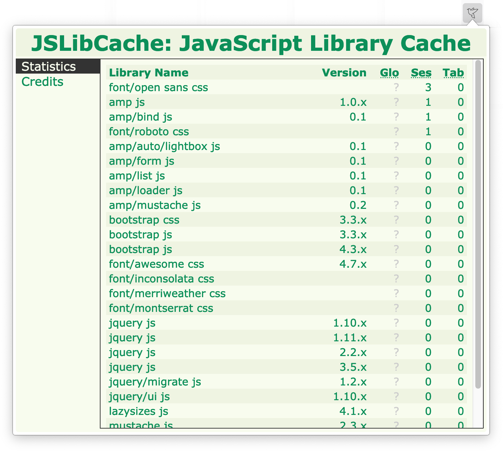

# JSLibCache (modern fork)

> Independent modern fork of [Jaaap/jslibcache](https://gitlab.com/Jaaap/jslibcache) (MPL-2.0).
> Upstream's last release was `0.0.21` (2024); this fork restarts at `0.1.0` with a new Firefox extension ID (`jslibcache@itsrody.github.io`), so it installs side-by-side and does not claim upstream's AMO listing.

A WebExtension for Firefox / Chrome that enhances privacy by serving requests to popular CDNs from local cache/storage.

It is similar to [Decentraleyes](https://git.synz.io/Synzvato/decentraleyes/) / [LocalCDN](https://codeberg.org/nobody/LocalCDN).

It serves Javascript libraries, CSS files and Fonts that a website tries to load from popular CDNs like ajax.googleapis.com.


## Difference between JSLibCache and Decentraleyes / LocalCDN
JSLibCache fetches resources from CDNs dynamically, once. So if a website you visit requests
https://ajax.googleapis.com/ajax/libs/jquery/3.5.1/jquery.min.js
and that lib is not yet in the local cache, it is fetched from the CDN and put into local storage for subsequent requests.

## Download for Firefox, Chrome
Original upstream listing (not this fork): https://addons.mozilla.org/en-US/firefox/addon/jslibcache/

For this fork, build from source:
```
npm ci
npm run build
```
then load `web-ext-artifacts/jslibcache.xpi` in Firefox, or load the repo as an unpacked extension in Chrome.

## What's new in this fork (0.1.0)
- ES modules split: `background.js` (424 lines) → `src/` modules
- IndexedDB cache (`entries` + `stats` stores) with one-time `storage.local` migration, instead of capped `storage.local`
- Bundled Google Fonts + `resources/fonts/manifest.json` + `tools/build-fonts-manifest.mjs`; font CSS served with `data:` URIs embedded (works around Bugzilla 1645683)
- Firefox 158+ support: `strict_min_version 158.0`, `data_collection_permissions: none`, MV2 module background
- Tooling: `eslint`, `tsc`, `web-ext lint/build`, `node test/run.mjs`, GitHub Actions CI

## Which CDNs are supported?
The following CDNs are or will be supported:
1. ajax.aspnetcdn.com
1. ajax.cloudflare.com
1. ajax.googleapis.com
1. ajax.microsoft.com
1. ajax.proxy.ustclug.org
1. akamai-webcdn.kgstatic.net
1. apps.bdimg.com
1. cdn.ampproject.org
1. cdn.bootcss.com
1. cdn.jsdelivr.net
1. cdn.sstatic.net
1. cdn.staticfile.org
1. cdnjs.cloudflare.com
1. code.createjs.com
1. code.jquery.com
1. fonts.googleapis.com
1. fonts.gstatic.com
1. lib.baomitu.com
1. lib.sinaapp.com
1. libs.baidu.com
1. mat1.gtimg.com
1. maxcdn.bootstrapcdn.com
1. netdna.bootstrapcdn.com
1. pagecdn.io
1. sdn.geekzu.org
1. stackpath.bootstrapcdn.com
1. unpkg.com
1. upcdn.b0.upaiyun.com
1. use.fontawesome.com
1. yandex.st
1. yastatic.net
